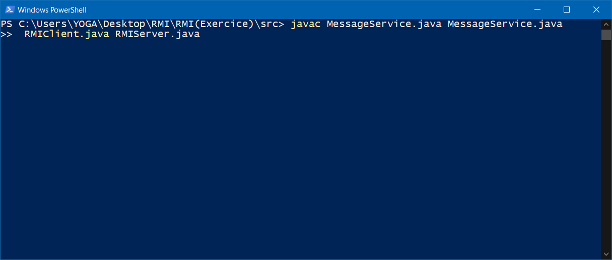
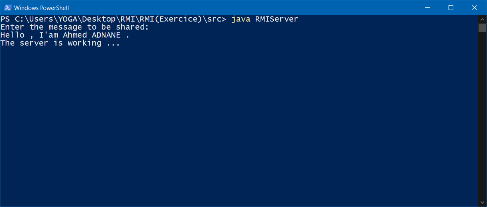
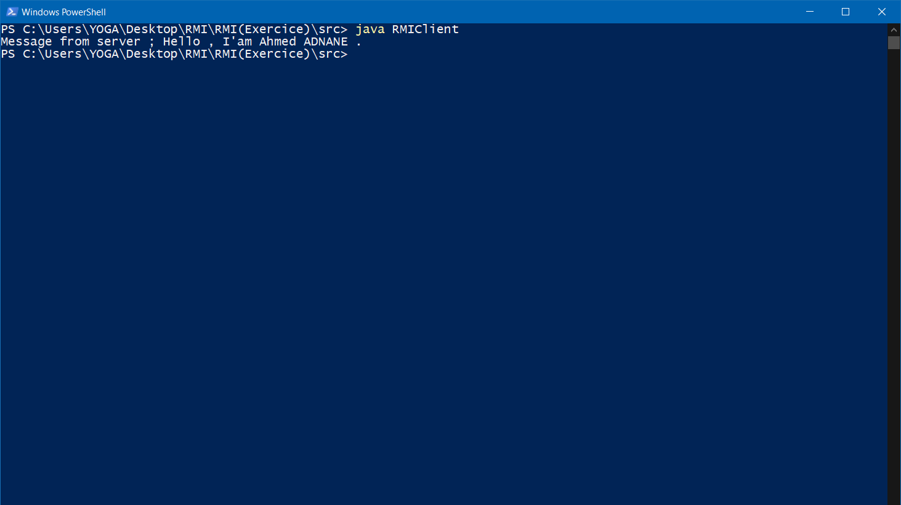

#Ce petit programme est de type RMI .

-il permet de envoyer un message du serveur *(Qui est saisi par utilisateur)* au client . 

1- On va compiler les classes par la cmd ***javac*** :

2- Executer server puis inserer Le texte a envoyer :

3- Tant que le serveur est execute ,on execute le client:

